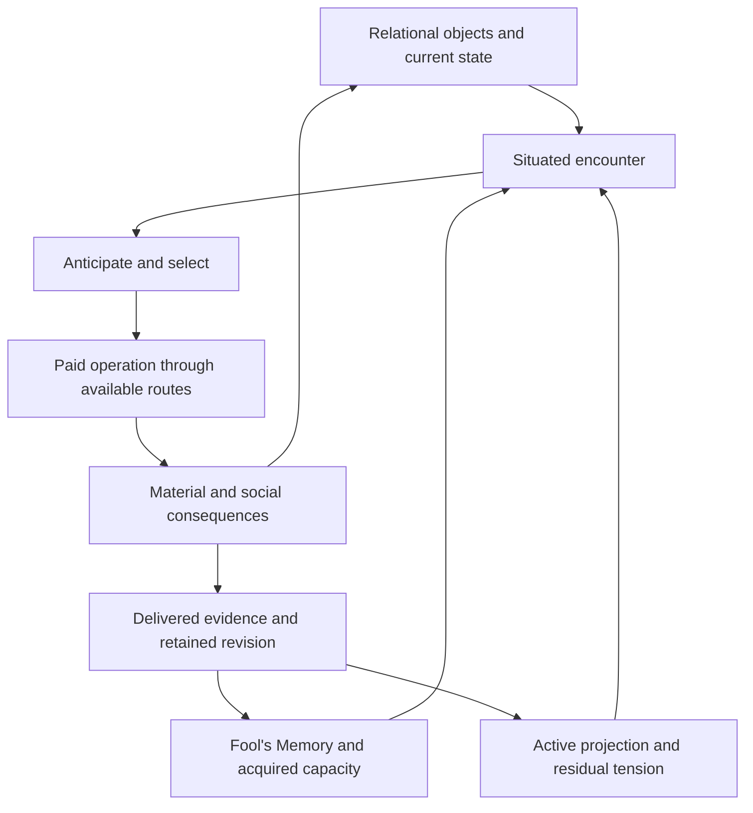

# Holonic Living Engine: conception of the unified object engine

Target architecture · Version 1 · 21 September 2026

This document defines the engine we intend to build. It establishes the object model, the relationships among its existing theoretical structures, the fuller Shell conception, and the behavior that would demonstrate success. It is a design proposal. Implementation sequence, milestone numbering, estimates, and acceptance thresholds belong to the subsequent planning discussion.

The supplied R21B archive is the implementation baseline. The present conversation supplies the design direction: Fool’s Memory, Model A, the Crux of Perspectives, and operations describe connected aspects of one evolving object; Shells can project onto any addressable object; representation should preserve individual histories economically. Source-defined structures, choices already implemented, and new design proposals retain their respective status.

**The target is a world whose material processes and modeled subjectivity use one relational object architecture.** Each participant inhabits a situated account of that world, acts through the capacities it has acquired, and changes both the world and its own conceptual organization through consequences. The engine makes the continuity between those changes explicit.

## The foundations we carry forward

The attached R21B report establishes development results within a declared finite domain and resource contract. It reports 60 development candidates and 60 separately constructed witnesses, 40 successful positive-budget episodes on each side, and honest deferral in zero-budget cases. It reports 912 distinct passing tests. Its held-out release evaluation remained open at that handoff. Those results belong to R21B; they are not validation of this proposed architecture.

Review of the supplied source confirms that its 98 runtime modules match their counterparts in the R21C source previously inspected in this conversation. That comparison supports using the earlier source observations here; it does not transfer later evaluation results into the attached report.

| Foundation in the inspected baseline | What the target preserves and extends |
| --- | --- |
| Versioned identities and a chronological event journal | Continuous identity, exact causal lineage, and explicit revisions across all object roles |
| Participant-owned observations, memory, and processing evidence | Situated access throughout the common representation |
| Conceptual relations and tensions with references to particular evidence | A general conceptual organization extending beyond the supplied entrusted-use domain |
| Paid Model A routes and partial work | Consequential differences in access, effort, completion, and acquired capacity |
| Material lineage, correction, reownership, recurrence, and clearance evidence | Shell patterns that can bind to arbitrary targets and develop across contexts |
| Recursive/shared closure in a finite constructor grammar | A general contract connecting constituent work and collective organization |
| Actor-local reuse of completed predicate work | Shared physical storage with actor-specific rights to use learned results |
| Checkpoint replay, invalidation, and independent raw accounting | Auditable behavior and performance as the representation changes |

The baseline’s domain-specific records and policies provide behavioral witnesses. Their particular field layouts and finite menus do not define the limits of the new ontology.

## One object architecture, many distinct objects

The engine uses one common identity, relationship, transformation, and provenance system. Material bodies, events, concepts, procedures, perceptions, and institutions participate in that system through explicit roles and constraints. Sharing an object architecture does not merge distinct instances or require every object to run a complete mind.

An object has an identity through change, a current organization, relationships with other objects, and conditions governing its possible transformations. A physical tool carries material state. A conceptual distinction carries relational organization and a history of use. A collective procedure carries dependencies on participants, agreements, and actual performances. Each is addressable through the same system.

| Object concern | Required representation |
| --- | --- |
| Identity | Stable instance identity, exact revision, and lineage through change, division, combination, or replacement |
| Shared form | References to reusable definitions, invariant relationships, constraints, and operation descriptions |
| Current state | The particular values and changes required to determine supported interactions |
| Relations | Typed, directed links with explicit participants, scope, and validity; a relation can itself be an object |
| Composition | Part/whole and membership links with explicit rules for resource ownership and aggregate behavior |
| Occurrence and claim status | Distinctions among an actual event, an observation, a remembered claim, a hypothetical possibility, and an interpretation |
| Provenance | The observations, transformations, and earlier revisions on which a state or claim depends |
| Optional participation | Memory, Model A, anticipation, agency, or collective governance capabilities when the object requires them |

A definition can be shared by many instances. Two bowls remain two bowls even when their descriptions have identical values. A shared memory fragment remains separately accessible to each participant through its own bindings. A collective obligation can refer to the same tool as an individual memory without copying the tool or conferring ownership of it.

The smallest values should remain compact values. They need full object identity when relationships, independent change, provenance, or interaction require it. This avoids constructing a complete holon for every number and adjective.

## The existing geometries organize the same process

The design follows the user’s proposed ordering of full conceptual organization, Model A, Crux, and operations. The following assigns each an operational responsibility; it does not yet claim a derived geometric projection theorem.

| Structural level | Responsibility in the unified engine |
| --- | --- |
| Full object / proposed 4D organization | The relational whole through changing context, conceptual tension, retained history, and nesting |
| Model A / three-dimensional cube structures | How a particular holon enters, routes, values, and pays for processing the organization |
| Crux / two-dimensional perspective square | Which individual or collective, interior or exterior aspect is being registered or changed |
| Operation / realized path | A concrete, time-consuming transformation through the available organization |

These are connected descriptions with different information content. The full object is not encoded in four scalar values. Model A’s cube coordinates and function dimensionality are distinct concepts. The formal Crux movement carries origin, destination, and polarity; its five-bit movement type identifies grammar, while its content, evidence, and actual realization require additional state.

Fool’s Memory gives the object conceptual continuity and contextual access. Model A gives the participating holon its differentiated processing organization. The Crux gives a movement its perspective relationship. Operations realize change and return consequences into the same organization.

The Kindred Fold’s bridge remains explicit. In that bridge, I–IT and WE–ITS have no single-function edge. A named Crux movement can describe the result of a composed path; naming it does not grant an unearned crossing. Type coordinates, rationality, ordering, and acquired competence must survive any compact representation. Development improves the available realization while preserving the source-defined Model A structure.

The intended unity can be expressed as one rule: a realized change names its participants and affected relations once; material consequences, delivered observations, conceptual revisions, and collective effects retain their causal links to that change.

Every proposed operation therefore names its input revisions, permitted observations, transformation rule, required work, and affected relations. Partial work preserves its position and paid cost. Before a result is committed, the runtime checks the inputs and actual execution constraints that must still hold. A changed dependency can require new work or invalidate completion. Already performed physical effects remain historical events, and an internal revision cannot retroactively erase them. The resulting observations and conceptual updates have their own delivery and completion events, so one causal structure can support delayed, incomplete, and conflicting accounts.

## Matter becomes organized capacity for interaction

Within the simulation, an independently represented material unit is an organization whose state can make a difference to supported interactions. Its boundary can be a physical surface, a maintained process, an accepted membership, or another explicit condition of identity.

A flame persists through exchange. A tool persists through use and repair. A routine persists through repeated performance and teaching. Their persistence rules differ and belong in the model. Sharing representation does not make every persistence rule interchangeable.

Material behavior must be executable. The environment provides actual transition laws and primitive affordances; participants encounter those laws through observations and action. They can discover properties, compose new uses, and revise concepts. Merely inventing a concept or naming a new action cannot grant a physical capability absent from the world’s laws.

For an inhabited world, this architecture should support resources, bodies, tools, shelters, environmental processes, and changing social arrangements. The same event can affect several: a failed repair consumes resources, changes a tool, revises an expectation, strains an agreement, and alters a group’s future procedure.

Material truth and a participant’s account have distinct roles within the common architecture. The world commits actual transitions. Participants propose, perceive, remember, and infer according to their access. A false expectation is an actual state of a participant; the event it predicts retains its separate occurrence status.

## Fool’s Memory carries conceptual tension and continuity

Suit, rank, cue, and reference identities supply stable orientation. Their supplied meanings remain available independently of each holon’s interpretation. An unspecified source meaning remains explicitly unspecified. A revision of a shared definition creates a new version with its lineage intact.

Experience produces situated associations, relation patterns, expectations, and tension around those anchors. A holon can hold contradictory material in different contexts, revisit an earlier interpretation, and acquire a more differentiated organization through practice. The anchor’s continued identity allows those changes to be followed.

Names, dates, particular ownership records, and other exact details use indexed records. Fool’s Memory refers to that evidence when its conceptual relationships require it. Detail retrieval and conceptual traversal can therefore have different efficient storage layouts while participating in one object system.

A useful retained capacity contains more than a label for success. It retains the relationships learned, the conditions under which they apply, access paths that can bring them forward, evidence from actual practice, and the dependencies that can invalidate or narrow present use. Teaching can supply material; the recipient’s own acquired capacity remains separately evidenced.

## A Shell is a persistent deformation of encounter

Every participating holon encounters an object through a situated selection and organization of information. A Shell is a persistent defensive deformation within that process. It can bind to a physical thing, a person, a group, a rule, a memory, a concept, a possibility, an action, or a relation between any of these.

The target object need not possess a mind. The projecting holon, the projected-on object, the carrier through which the projection is expressed, and the entity that bears the consequences can all be different.

| Shell concern | What the engine must keep |
| --- | --- |
| Origin and ownership | Whose experience generated the pattern, who currently maintains it, and any transfers or shared maintenance |
| Target binding | The exact object or relational pattern encountered, with context-specific scope |
| Deformation | An executable change to salience, attribution, expected consequences, access, routing, or completion conditions |
| Trigger | The demand and cues under which the deformation becomes active |
| History | Supporting and contrary experiences, earlier bindings, and treatment or compensation lineage |
| Material expression | Actions, messages, arrangements, or rules through which the pattern changes others’ conditions |
| Persistence | Evidence of recurrence and residual effects after meaningful opportunities for correction |

These concerns use ordinary objects and relations in the common architecture. A projection binding is addressable and can itself become an object of reflection. The runtime should support recurring transformation patterns shared across bindings, with target-specific parameters and evidence.

“Receiving help means surrendering control” illustrates a candidate pattern. It may turn a loan, an instruction, a partnership, and a collective duty into versions of the same threat. Different objects can therefore activate a common history without that history being copied into every object. The same object can simultaneously carry incompatible projections from different participants.

The deformation must perform identifiable work. For example, it might add an expected obligation unsupported by the encountered terms; conceal an available route by making external approval a completion condition; or route a discrepancy into a compensating procedure that leaves the original relationship unexamined. A narrative sentence alone is insufficient implementation.

The engine also preserves accurate threat recognition, ordinary uncertainty, and differing values. Persistence of disagreement does not establish a Shell. Evaluation must consider the selected demand, access to relevant evidence, available capacity and resources, and actual corrective work. Resource exhaustion, absence of an opportunity, refusal by another party, or a valid boundary can explain noncompletion.

A Shell assessment is an evidence-based readout of those dynamics. Participants do not receive an evaluator’s diagnosis or a clearance flag as privileged knowledge. They encounter the consequences and develop their own accounts.

## Personal deformations can acquire public consequences

A holon’s projection can alter its action selection, which changes the shared environment. Other holons then acquire experiences of that changed environment. A group may stabilize the resulting practice as a rule. The rule becomes an actual object with observable effects, even if a distorted expectation helped originate it.

This is the materialization of a projection. It requires a causal chain of communication, uptake, enactment, and maintenance. The engine cannot install a collective Shell merely because multiple actors receive the same label. It also cannot remove a real institutional constraint merely because one participant revises its belief.

Collective correction requires the appropriate collective changes: renegotiated commitments, changed practices, available alternatives, and sustained evidence. Individual correction can precede those changes, fail to spread, or become part of the pressure that eventually produces them.

This is how participants can remain largely intelligible within their own experience while sustaining mutually incompatible accounts. The world does not need to force their accounts into immediate agreement. Their interacting actions supply the consequences through which differences may sharpen, adapt, or become entrenched.

## Anticipation, action, and development form one continuing circuit

The target includes anticipation as explicit, bounded work. A holon uses accessible material to construct possible continuations, record expected consequences and uncertainty, and select an affordable action. These expectations remain distinguishable from observations and from actual world outcomes.

The following diagram shows activities over one object graph. The boxes are views and operations on that graph, rather than separate copies of reality.

Crux and Model A govern the encounter, selection, operation, and revision paths. A distortion may change anticipation or routing before a holon can formulate a verbal explanation. A failed prediction becomes potentially useful material when the participant actually receives evidence and can process it.

Pressure, fear, scarcity, fatigue, and boredom influence attention, urgency, available work, and willingness to explore. They must have causal inputs and effects. They do not grant a new capacity or a developmental rank by being incremented.

Development changes which relations the holon can keep present, which paths it can complete, how broadly a learned distinction applies, and how it handles later demand. Useful growth can be local, uneven, and partly reversible. Successful practice may reduce a Shell’s scope while other bindings continue to recur.

Release, contextual expansion, reorganization, practice, and reownership remain consequential work. Retention must survive later use, changed partners, withdrawal of support, and fresh situations. Quiet time alone does not establish clearance. A successful case on one object does not automatically clear every binding of the same pattern.

No imported developmental color sequence is generated by definition. If a stage vocabulary is displayed, its empirical or interpretive status remains separate from the engine’s measured capacities and transitions.

Autonomy requires reasons to continue, stop, switch, ask, rest, or seek further evidence. The scheduler advances tasks through meaningful events and paid work. Waiting for a missing observation or resource is an explicit state. A holon with no current feasible work can be idle without losing its continuing motives or obligations.

## Nesting has a concrete coherence contract

The general connection between levels needs an operational law. This design proposes the following contract; it is a target for implementation and evaluation, not a theorem already established by the source documents.

1. A composite names its constituent identities, membership, and boundary conditions. Overlapping relations are allowed, while resource ownership prevents double spending or double counting.
2. Its aggregate state comes from a versioned projection of constituent states and relations. The projection names its dependencies and the interactions for which the summary is adequate.
3. A composite action has explicit effects or decomposes into constituent work. It can succeed only when the necessary commitments, resources, and performances actually occur.
4. Constituent changes invalidate affected aggregate projections. A completed revision of a participant’s accessible account requires an appropriate observation or processing event; cache invalidation itself conveys no private fact.
5. A collective capacity belongs to the organization that has demonstrated and retained it. Membership does not automatically confer that capacity on every individual.
6. Recursive references use finite identities. The system can contain a holon that holds a representation of the system without repeatedly copying the complete system inside itself.

Parent summaries and child detail must agree about supported consequences. When an operation needs a distinction absent from the summary, the engine resolves the required detail before committing the effect. Re-expansion may use retained detail or a valid deterministic reconstruction. Discarded historical distinctions cannot be invented later.

A collective body should be maintainable through changing membership. Succession therefore preserves actual duties, current consent, teachable procedures, and their provenance. The organization can change without silently replacing the meaning of an earlier obligation.

## Language and organization use the same objects

Concepts, explanations, requests, conditions, promises, and procedures refer to the same relationships that govern action. An utterance has an author, intended references, context, and interpretation by its receiver. Shared vocabulary is supported by repeated successful use and repair of misunderstanding.

A new concept can identify a recurring relationship across encountered objects. A new procedure can compose acquired operations with explicit conditions and effects. A new institutional rule can stabilize participant-generated commitments. All three require a connection to what participants can actually distinguish, perform, or maintain.

Self-organization includes learning which distinctions belong together and which must separate. A useful generalization can bind different encounters to a shared pattern; a consequential counterexample can split that pattern into conditional variants. This changes the holon’s conceptual organization while preserving the underlying instance identities and histories. Shared reference meanings supply orientation through those changes.

The general target replaces scenario-specific menus of complete answers with composable representations and bounded search over them. The substrate will still have explicit primitive operations. Extending primitive world capabilities remains a separate change to the environment, while participants can discover and compose within what the environment supports.

Successive funded work can extend retained concepts, vocabulary, and procedure composition. Each search has finite work and storage budgets and reports deferral or incomplete exploration when those budgets end. A fixed demonstration repertoire does not become a permanent ceiling on the representation, and retained complexity must continue to justify its access and maintenance costs.

Expressive language should reveal a holon’s current account: what it noticed, expects, values, cannot yet complete, and wants another party to do. Optional fluent language generation may express that account, but inferred prose cannot silently create memories, perceptions, capacities, or actions in the simulation.

## Efficiency follows the structure of meaningful differences

The main storage target is approximately:

**shared definitions + instance state + situated bindings + projection differences + dependencies + retained history.**

This is a description of the intended sources of cost, not a measured complexity bound. Repeated structure offers savings; highly unique histories and dense dependencies still require substantial space and work.

| Mechanism | Required condition |
| --- | --- |
| Shared immutable definitions and relation patterns | Equal structure is verified; individual identity and meaning ownership remain distinct |
| Compact references and versioned state deltas | Exact reconstruction retains lineage and all behaviorally relevant distinctions |
| Actor-local learned reuse | Completed work, accessible evidence, current context, and current dependencies support reuse |
| Demand-driven views | The actor’s access and processing state determine what may be produced; global truth does not leak through a derived view |
| Dependency-driven updates | Changed inputs wake affected work; broad genuine consequences can still require broad updates |
| Aggregate representations | The summary is sufficient for the supported observations and actions at that level |
| Segmented historical storage | Old records remain available for exact reconstruction and audit without ordinary work scanning the full history |
| Event-based scheduling | Unfinished work, future events, available resources, and waiting conditions are preserved |

Physical deduplication and personal acquisition are different accounting facts. Two holons may reference the same stored definition while having different skill, access, confidence, or ability to use it. Shared storage must not provide unearned knowledge or competence.

The engine needs two accounting views. Machine cost measures memory, CPU time, serialization, and I/O. Modeled cost measures a participant’s processing, action, energy, and time under an explicit contract. A faster representation does not silently rewrite Model A prices or replenish a participant’s wallet. A reduction in required modeled work must be separately justified, as R21B did for reuse of completed predicates.

Long-running inhabited worlds can include replenishment through explicit causes such as food, rest, or delivered resources. Such rules belong to a versioned world contract. They do not retroactively change the finite R21B allocation or turn a failed historical budget into a success.

Lossless sharing is the default optimization. Any lossy summary has a named scope and error policy. Small cracks, rare exceptions, contested permissions, and weakly supported interpretations must survive when they can change later consequences. Prime encoding, fractal language, or a small coordinate count alone does not establish a compression advantage.

## A scene that the target engine should produce

A community shares a repair workshop. A saw has a stable identity, material condition, present custody, and a history of use. The community has a maintenance agreement. Three participants have learned different relationships around assistance and responsibility.

One participant expects help to create continuing control. Another expects help to express mutual care. A third distinguishes the agreed task from broader obligation. These initial histories are explicit experimental conditions in a demonstration; subsequent reactions follow from the participants’ own encounters and processing.

An offer to help sharpen the saw reaches each person through its own observations and context. Their forecasts, attention, and intended replies can diverge. The first participant may invoke a familiar approval requirement. The second may accept an unstated burden. The third may ask what was actually agreed. Those responses require relevant capacities and feasible routes; personality labels do not prescribe the lines.

The saw’s condition and the actual agreement still constrain what happens. Messages can be misunderstood. Work can remain unfinished. Costs can be borne by someone other than the person who initiated a projection. A repeated compensating arrangement can become a workshop rule, making a personal expectation part of the environment others actually face.

Later, a successful limited collaboration may support a new distinction: accepting this assistance does not transfer continuing authority. The first participant can retain that distinction for this task and still react defensively in another relationship. Broader development requires further applicable experience and a revised general pattern.

The same underlying objects connect physical repair, subjective meaning, shared expectation, systemic practice, and retained change. An inspector can follow those links while the participants themselves retain their separate access.

## What success would look like

These are properties of the target, rather than an implementation sequence. Exact experimental protocols and thresholds are intentionally left for the planning stage.

| Property | Evidence the completed design should produce |
| --- | --- |
| Common object continuity | A material action, delivered observation, conceptual revision, and later decision can be traced through one coherent causal lineage |
| Distinct subjectivity | Different histories produce intelligible differences about the same object without private-state leakage |
| Projection across targets | A recurring deformation transfers to new applicable objects; unrelated objects and contexts remain distinguishable |
| Graduated correction | A local repair, generalization, residual binding, and recurrence have different observable outcomes |
| Consequential personality | Routing and capacity differences affect attention, work, decisions, and learning while preserving primitive meanings |
| General composition | New concepts, procedures, and organizations can be formed within the available substrate without inserting complete scenario answers |
| Coherent nesting | Parent outcomes agree with constituent work; membership changes preserve identities, obligations, and actual competence |
| Sustained autonomy | Holons pursue and revise demands, account for resources, and retain appropriate stopping and waiting conditions |
| Efficient representation | Compared under matched workloads, memory and execution costs improve without changing protected outcomes, access, history, or resource accounting |
| Honest limits | Incomplete work, invalid evidence, unsupported claims, depleted resources, and failures remain visible |

Performance comparisons must include the compressed checkpoint baseline as well as live memory, execution, restoration, and historical reconstruction. Outcomes should be checked across distinct histories and sparse and dense interactions. Neither a smaller uncompressed encoding nor a single favorable scene establishes general superiority.

## The decisions this conception makes, and the questions it leaves

The recommended architecture is one versioned relational object system with compact exact particulars, shared invariant structure, situated conceptual bindings, executable transformations, and dependency-tracked derived views. Shells are generalized relational dynamics within it. Perspective, memory, material action, and development use the same causal identities.

The general nesting contract above is the proposed connection between levels. The exact geometric meaning of a four-dimensional object and its curvature remains to be formalized. We should define and measure changes in access, relation, routing, and consequence before claiming a numerical curvature model.

General Shell recognition across arbitrary domains remains a research problem. The target specifies what evidence must be available and how deformations can operate; it does not assume a universal detector. The admissible language for generated transformations, the scope of aggregate equivalence, and the balance between retained detail and historical storage likewise need precise implementation contracts.

The conception gives the next discussion a concrete destination: specify the smallest coherent version of this shared object, identify which existing capacities already realize parts of it, and determine the changes required to make the whole architecture operate continuously.

## Source basis

- **User direction in this conversation:** one object connecting material processes and modeled subjectivity; Fool’s Memory–Model A–Crux–operation integration; projection onto arbitrary objects; person-specific deformation with locally intelligible behavior; conception before implementation planning.
- **Attached baseline:** `HLE_New_Build_Step_R21B_Report_v1(1).md`; `HolonicLivingEngine_Rebuild_R21B_v1(1).zip`. Relevant inspected modules include `concept_records.py`, `concept_structure.py`, `conceptual.py`, `compensation_records.py`, `development_contracts.py`, `reconciliation_records.py`, `individuation_records.py`, `closure_policy.py`, `paid_work.py`, `world_records.py`, and `codec.py`. The attached raw evidence archives were inventoried; their experiments were not rerun for this design.
- **Fools_Memory_Path_Relational_Recall_and_Learned_Meaning.docx:** stable cue identities, contextual relational access, historical interpretations, recurrence, and learning through consequences. The present design follows the user’s explicit emphasis on conceptual tension while retaining indexed particulars as referenced evidence.
- **The_Crux_v6_Readable_Examined_Edition (1).docx:** perspectives on one event, route grammar, polarity, conductivity, and the open general nesting problem.
- **The_Kindred_Fold_v0.2(2).docx:** the stipulated Model A–Crux bridge, retained ordering information, missing single-function row edges, and the interpretive mutual containment of a member and its represented system.
- **Generative_Semantics_of_Information_Metabolism.docx:** invariant primitive domains, carriers and fields, differentiated Model A access, and the proposed continuous metabolic process.
- **SOMU comparison:** [Revisiting Self-Operating Mathematical Universe (2024)](https://link.springer.com/chapter/10.1007/978-981-97-0232-9_6), used as a comparison for feedback, transformation, bonding, and nested invariant organization. Its wider physical claims are not prerequisites of this software design.
- **Predictive representation comparison:** [Shalizi and Crutchfield, Computational Mechanics](https://arxiv.org/abs/cond-mat/9907176), relevant to preserving predictive distinctions. A world with interventions needs its own explicit equivalence conditions; the cited result is not an automatic proof for this architecture.
